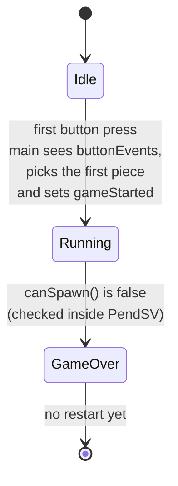
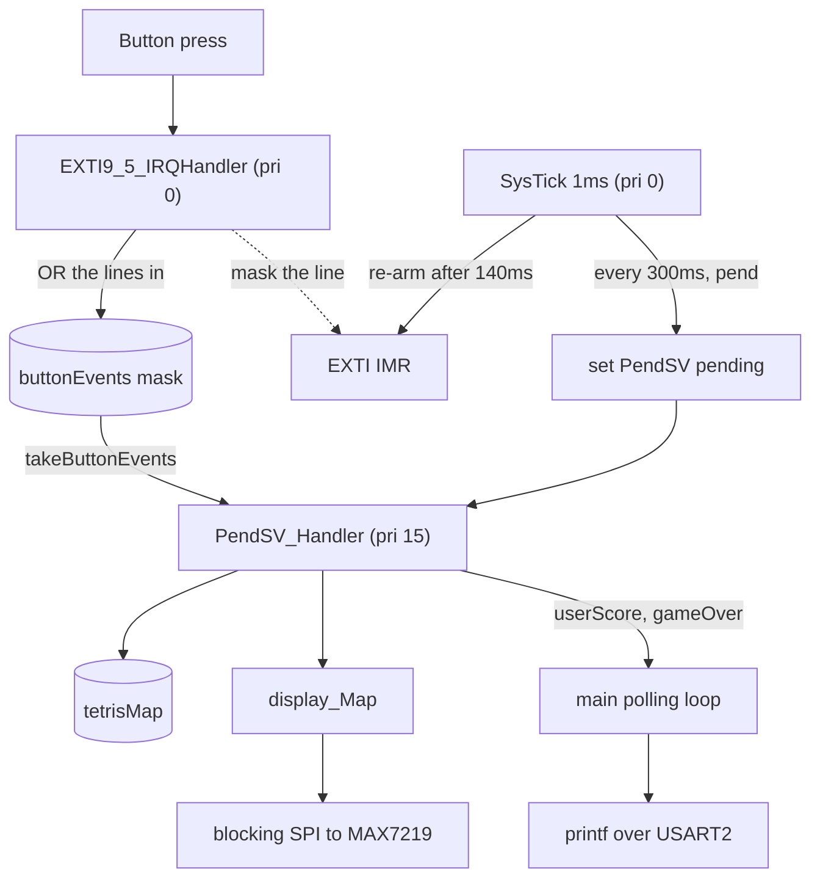
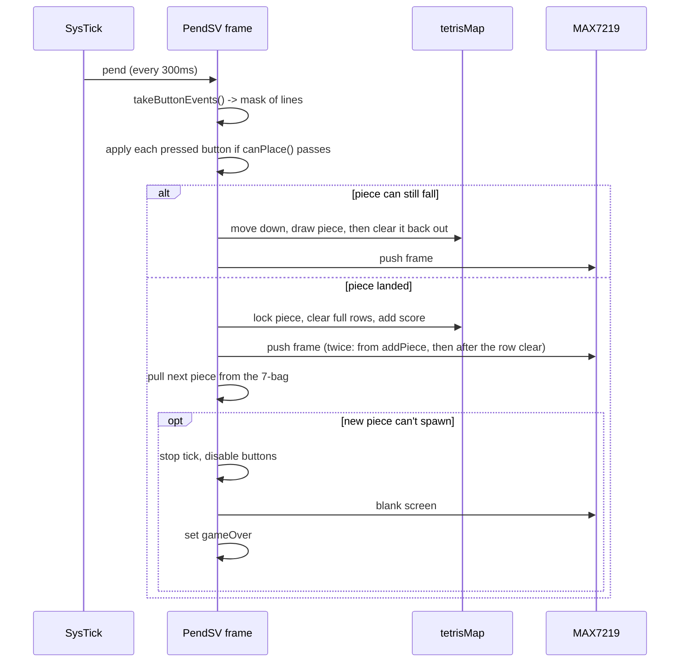

# Tetris on STM32F446, design v1

A write-up of the code as it stands, before any restructuring: what states the
game goes through, which interrupts it runs in, what happens in one frame, and
how it drives the hardware. Nothing here is a proposal, it's what's on the board
right now.

Board is a NUCLEO-F446RE on the 16 MHz HSI, no PLL configured. Display is 4x
MAX7219 8x8 matrices daisy-chained on SPI2, playfield 8 wide and 32 tall. Four
buttons on EXTI9_5, score over UART. No HAL, no CMSIS device headers, no RTOS:
the register structs and drivers are written from RM0390.

## 1. Hardware map

| Signal | Pin | Notes |
|---|---|---|
| SPI2 SCK | PB13 | AF5 |
| SPI2 MISO | PB14 | AF5, unused (the display is write-only) |
| SPI2 MOSI | PB15 | AF5 |
| MAX7219 CS/LOAD | PB8 | plain GPIO output, toggled by hand around each transfer |
| Move left | PB9 | EXTI9, falling edge, pull-up |
| Move right | PB5 | EXTI5, falling edge, pull-up |
| Spin left | PB7 | EXTI7, falling edge, pull-up |
| Spin right | PB6 | EXTI6, falling edge, pull-up |
| UART TX | PA2 / USART2 | AF7, 115200 8N1, to the ST-LINK virtual COM port |

SPI2 runs as master, mode 0, 8-bit, fPCLK/2, with software slave management. SSM
and SSI are both set so the unused NSS pin can't drag the peripheral into a MODF
fault. PB8 has nothing to do with that, it's a plain GPIO I drive by hand as the
chip's CS/LOAD line.

All four buttons share the one `EXTI9_5` vector, so the handler reads `EXTI->PR`
to see which lines fired and takes them all at once
([tetris.c:278](Src/tetris.c#L278)).

Two things here block. `printf` is retargeted onto newlib's `_write`, which
pushes bytes out USART2 polling TXE and TC
([syscalls.c:117](Src/syscalls.c#L117)); that only ever runs in `main`, so it
costs nothing. `SPI_SendData` spins on TXE for each byte and on BSY at the end
([stm32f446xx_spi_driver.c:125](drivers/Src/stm32f446xx_spi_driver.c#L125)), so
a frame is fully clocked out before it returns. That one runs inside PendSV,
which matters in section 3.

## 2. States

Three states, tracked with two flags. They're `volatile bool`s in
[tetris.c:88-89](Src/tetris.c#L88-L89):

```c
volatile bool gameStarted = false; // set by main, gates the game tick
volatile bool gameOver    = false; // set by PendSV when a piece can't spawn
```

Idle is just "neither is set yet". I used to have a third flag
(`startRequested`) for the first press, but once the buttons went through the
`buttonEvents` mask (section 3) it was redundant, `main` waits on that directly
now.



**Idle.** Everything's initialised and `main` sits in `while (!buttonEvents);`
([main.c:125](Src/main.c#L125)). First press wakes it up, it pulls the first
piece from the 7-bag (with `globalTime` as the shuffle seed), clears
`buttonEvents` so that starting press doesn't also nudge the piece, and sets
`gameStarted`. That flag is what actually lets the tick start firing frames.

**Running.** Pieces fall, buttons move and rotate them, full rows clear.

**Game over.** A fresh piece has nowhere to spawn. PendSV stops the tick,
disables the button IRQ, blanks the display and sets `gameOver`. `main` sees the
flag and prints the final score. No restart path yet, you power-cycle.

The start is still a bit awkward: the ISR records the press, `main` spins on it
and flips `gameStarted` itself. Two contexts for one transition. It works, but
it's the seam I like least here.

## 3. Execution contexts

No RTOS. Four contexts, and the whole scheme rests on one decision: **the game
frame runs at the lowest priority, so anything else can interrupt it.**

| Context | Priority | Job |
|---|---|---|
| `main` | thread | Init, wait for start, then loop printing score and game over over UART |
| `SysTick_Handler` | 0 (default) | 1 ms tick. Counts `globalTime`, re-arms any debouncing button lines, pends PendSV every `GAMESPEED` (300) ms once started |
| `EXTI9_5_IRQHandler` | 0 (default) | Record which button lines fired into `buttonEvents`, mask them, and get out |
| `PendSV_Handler` | 15 (lowest) | The entire game frame |

Only PendSV's priority is set explicitly, to 15
([main.c:115](Src/main.c#L115)). SysTick and EXTI9_5 keep the reset default of
0, so those two are equal: neither preempts the other, whichever got in first
finishes. Both preempt PendSV.



SysTick does no game work. It counts, re-arms button lines that have finished
debouncing (more on that below), and every 300 ms it sets PendSV pending
(`SCB->ICSR = PENDSVSET`) and returns. The frame runs afterwards, once nothing
higher is left on the stack.

Buttons hand over through a single `volatile uint32_t buttonEvents`, one bit per
EXTI line. The ISR ORs in whatever fired, PendSV grabs the whole word and zeroes
it with interrupts masked (`CPSID i` / `CPSIE i` in `takeButtonEvents`,
[tetris.c:256](Src/tetris.c#L256)). A 32-bit store is atomic on Cortex-M anyway,
what the masking buys is that a press landing between the read and the zero
doesn't get thrown away by that zero.

Debounce isn't a timestamp check anymore, it's the line itself. When a line
fires, the ISR clears its PR bit and knocks the line out of `EXTI->IMR`, so the
peripheral just stops raising it. SysTick puts it back `DEBOUNCE_MS` (140) later,
clearing PR again first so all the chatter that piled up while it was masked
gets dropped instead of arriving in one burst
([tetris.c:296-299](Src/tetris.c#L296-L299)). Worth saying why 140 and not a few
ms: releasing the button bounces too, and those are falling edges just like the
press, so the window has to outlast a whole quick tap, not just the contact
settling on the way down. Each line masks independently, which is the actual
reason left+spin pressed together both make it through now.

## 4. One frame

All of this is `PendSV_Handler` ([tetris.c:317](Src/tetris.c#L317)), once every
300 ms:



Four things the diagram doesn't show:
 
- Each button is a separate `if` against the mask, not an either/or, so
  everything pressed since the last frame gets applied. Every check goes through
  one function, `canPlace(shape, rot, x, y)`
  ([tetris.c:133](Src/tetris.c#L133)); `canGoDown/Left/Right` and the two spin
  checks are thin wrappers that call it with a shifted position or rotation. One
  quirk falls out of this: press left and right in the same tick and the piece
  moves one left then one right and lands back where it started. It's harmless
  and honestly the sanest thing to do with two opposite inputs, but it's a side
  effect of the four-if layout, not something I sat down and designed. Same
  layout fixes the order though: move ifs come before spin ifs, so a move+spin
  in one frame shifts first and rotates around the new spot.
- `tetrisMap` never holds the falling piece. `addPiece()` draws it and refreshes
  the display from inside that same call, then `clearPiece()` takes it straight
  back out, which is why `canPlace()` never has to worry about the piece
  colliding with itself.
- The landing branch pushes the display twice, once from inside `addPiece()` and
  again after `removeFullRows()` ([tetris.c:337-339](Src/tetris.c#L337-L339)).
  A landing frame therefore costs two full blocking SPI pushes where a falling
  frame costs one.
- On game over the handler returns early, so that last frame doesn't add the
  per-tick score.

Pieces come from a 7-bag ([tetris.c:96](Src/tetris.c#L96)): all seven shapes get
Fisher-Yates shuffled, dealt out one at a time, then reshuffled, so you never
sit through a long drought of one piece. Each shape is four 4x4 bitmasks, one
per rotation, kept as `uint16_t` constants.

## 5. Where the code sits

- `main.c`: startup, peripheral init (SPI2 pins, buttons, clocks, MAX7219), the
  wait for the first press, and the score / game over UART loop.
- `tetris.c`: the game rules (collision, rotation, line clears, scoring, the
  7-bag), the three interrupt handlers, and the calls into the display driver.
- `syscalls.c`: USART2 setup and the `printf` retarget.
- `drivers/`: GPIO, SPI, RCC (table-driven clock enable and reset) and MAX7219,
  all from RM0390. `stm32f446xx.h` holds the register structs plus the SysTick,
  NVIC and SCB inline helpers.

`display_Map` lives in the MAX7219 driver but is declared `extern` and written
straight from `tetris.c` ([tetris.c:248](Src/tetris.c#L248)).
`convertTetrisMapToDisplayMap()` fills it and calls `max7219_UpdateDisplay()`.
That push isn't one long burst: it walks the 8 digit rows, opens a single CS
window per row and writes all four matrices back to back inside it, so each
device latches its own byte on the rising CS edge
([max7219_driver.c:65](drivers/Src/max7219_driver.c#L65)). Every write is an
address byte then a data byte, as two separate 1-byte SPI transactions.

Writing this out made two things obvious as targets for v2: `main.c` holds board
bring-up and game-over reporting at the same time, and `tetris.c` is game rules,
interrupt handlers and display calls in one file.
